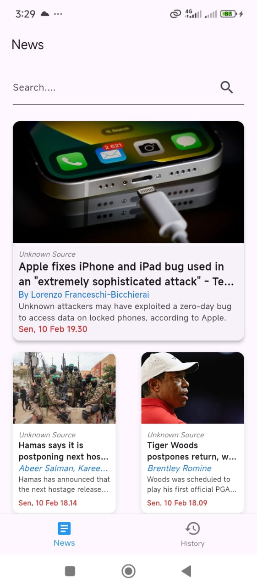

News App

News App adalah aplikasi Flutter yang memungkinkan pengguna untuk membaca berita internasional dengan mudah dan cepat. Aplikasi ini dilengkapi dengan beberapa fitur utama seperti splash screen, tampilan berita, pencarian berita, serta riwayat berita yang telah dibaca.

Fitur Utama

Splash Screen: Tampilan awal sebelum masuk ke halaman utama aplikasi.

Tampilan Berita: Menampilkan berita terbaru dari berbagai sumber terpercaya.

Navigasi ke Laman Resmi: Pengguna dapat mengklik salah satu berita untuk diarahkan ke laman resmi sumber berita.

Pencarian Berita: Memungkinkan pengguna mencari berita berdasarkan kata kunci.

History Berita: Menyimpan riwayat berita yang telah dibaca oleh pengguna.

Teknologi yang Digunakan

Flutter: Framework utama untuk pengembangan aplikasi.

Dart: Bahasa pemrograman yang digunakan dalam Flutter.

HTTP: Digunakan untuk mengambil data berita dari API.

Provider / Riverpod (Opsional): Untuk state management.

Cara Menjalankan Aplikasi

Clone repositori ini:

git clone https://github.com/username/newsapp.git

Masuk ke direktori proyek:

cd newsapp

Instal dependensi:

flutter pub get

Jalankan aplikasi di emulator atau perangkat fisik:

flutter run

Struktur Proyek

newsapp/
│-- lib/
│   │-- main.dart  // Entry point aplikasi
│   │-- screens/    // Folder untuk halaman aplikasi
│   │-- widgets/    // Komponen UI yang dapat digunakan kembali
│   │-- services/   // File untuk fetching API
│   │-- models/     // Model data berita
│-- assets/        // Folder untuk gambar dan icon
│-- pubspec.yaml   // Konfigurasi dependensi Flutter

Kontribusi

Jika ingin berkontribusi dalam pengembangan aplikasi ini, silakan fork repositori ini dan buat pull request dengan perubahan yang diusulkan.

  
  
  
  

